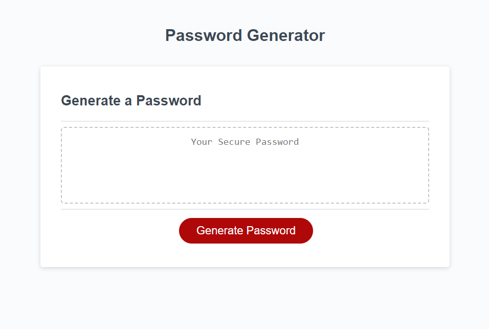

# Password Generator

A simple web-based password generator that allows users to generate random passwords based on their preferences.

## Features

* Specify the desired length of the password(between 8 and 128 characters).
* Choose to include or exclude different character types:
    * Lowercase letters (a-z)
    * Uppercase letters (A-Z)
    * Numbers (0-9)
    * Special Characters (!@#$%^&*())
* Generate a random password based on the specified preferences.

## Installation

Follow this link to the live site -> https://brendan-aper.github.io/week3-password-generator/

Follow this link to the github repo -> https://github.com/brendan-aper/week3-password-generator

## Usage

1. Follow the link to the password generator.

2. Click "Generate Password" button.

3. A prompt will appear asking you to enter the desired password length (between 8-128).

4. After entering the password length, you will be asked to confirm the inclusion of lowercase letters, uppercase letters, numbers, and special characters.

5. Based on your preferences, the app will generate a random password and display it in the designated area.

6. You can copy the generated password and use it as needed.

## License

N/A

## Credits

Most of this code was sourced from "The coding bootcamp" @ https://github.com/coding-boot-camp